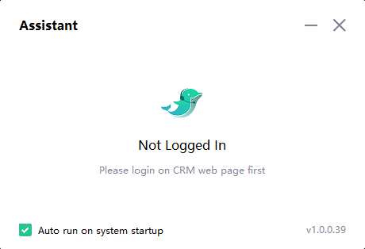
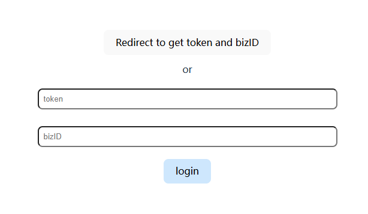
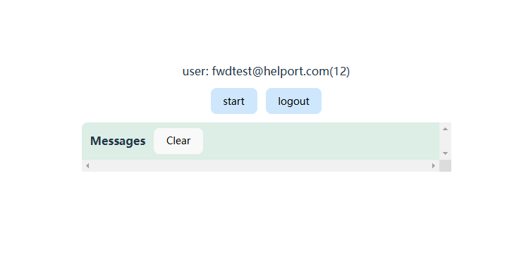
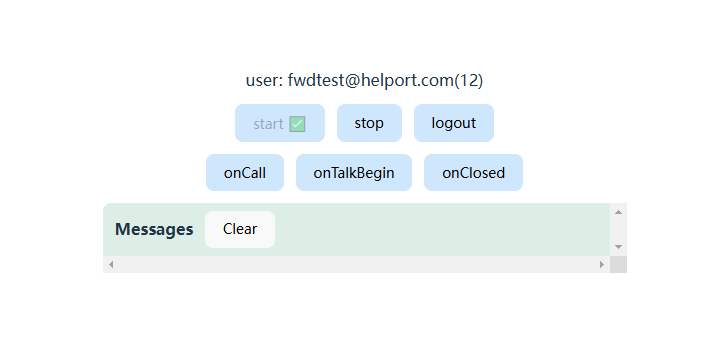

# How to Use This Demo

1. First, make sure you have downloaded and installed the [Assistant.exe](../../exe/assistantSetup_prod_1.0.0.39_en.exe)

   

2. Open the demo page.

3. Login Page:

   1. `Redirect to get token and bizID`: This button will redirect to the login page. After successful login, the token and bizID will be automatically filled in the input fields.
        
      Test Account 1:
      - Username: fwdtest@helport.com
      - Password: FWD@123456

      Test Account 2:
      - Username: fwdtest1@helport.com
      - Password: FWD@123456

   1. `Login`: Direct login. Upon successful login, it will redirect to the “Assistant” page.
   
   If you want to know the specific login process, you can refer to the Login section of [Helport for FWD](./helport-for-fwd.pdf).

   

4. Assistant Page:

   1. `start`: Start the assistant.
   2. `logout`: Log out.

   

5. Assistant Page - After Started:

   1. `stop`: Stop the assistant.
   2. `onCall`: Send the “Call Started” event. You can think of this as starting the call or beginning the ringing.
   3. `onTalkBegin`: Send the “Call Connected” event. After this event is triggered, the recording and transcription will start.
   4. `onClosed`: Send the “Call Ended” event.
   5. `Messages`: Listen to the `aiMessage` event to receive the incoming events.
      1. **Trigger Skill.nlp**: A knowledge base rule is currently configured such that when the phrase `how are you` is transcribed from the audio detected on the `customer side` (sound recorded by the speaker), it will trigger the Skill.nlp event.
      2. **Trigger Skill.quality**: A quality inspection rule is currently configured such that when the word `wait` is transcribed from the audio detected on the `agent side` (sound recorded by the microphone), it will trigger the Skill.quality event. 
   
   If you want to know how call events flow, you can refer to the "Call Events" section in [Helport for FWD](./helport-for-fwd.pdf).

   

6. Video Demo:

   <video controls src="./assets/demo.mp4" title="Title"></video>

