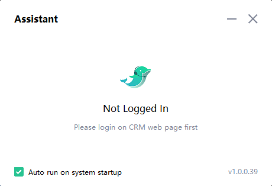

# 如何使用这个Demo

1. 请先确认你已经下载并且安装了[Assistant.exe](../../exe/assistantSetup_prod_1.0.0.39_en.exe)
   
   

2. 开启demo页面
   
3. 登录页
   1. `Redirect to get token and bizID`: 这个按钮会重定向到登录页，登录成功后，token和bizID会自动填充到输入框中
      
      测试账号1：
      - `用户名`：fwdtest@helport.com 
      - `密码`：FWD@123456

      测试账号2：
      - `用户名`：fwdtest1@helport.com 
      - `密码`：FWD@123456
   
   1. `Login`: 直接登录，登录成功后，会跳转到`辅助页`
   
   如何你想了解登录的具体流程，可以参考[Helport for FWD](./helport-for-fwd.pdf)的Login章节

 
   
   

4. 辅助页
   1. `start`: 开启辅助
   2. `logout`: 退出登录
   
   

5. 辅助页-开启后
   1. `stop`: 关闭辅助
   2. `onCall`: 发送`通话开始`事件, 可以理解为开始呼叫,开始振铃
   3. `onTalkBegin`: 发送`接通`事件, 该事件触发之后才会开始录音，并且转写
   4. `onClosed`: 发送`挂断`事件
   5. `Messages`: 通过监听`aiMessage`事件，接收到的事件
      1. 触发Skill.nlp: 目前配置了一条知识库，当`客户侧`（扬声器录制到的声音）语音检测到`how are you`转写时，会触发Skill.nlp事件
      2. 触发Skill.quality: 目前配置了一条质检规则，当`坐席测`（麦克风录制到的声音）语音检测到`wait, don't`转写时，会触发Skill.quality事件
   
   如果你想了解通话事件是如何流转的，可以参考[Helport for FWD](./helport-for-fwd.pdf)的Call Events章节
   
   

   
6. 视频演示
   
   <video controls src="./assets/demo.mp4" title="Title"></video>